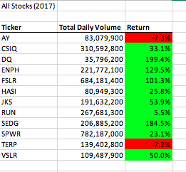
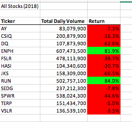
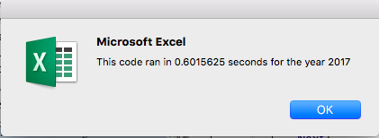
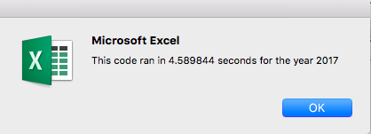
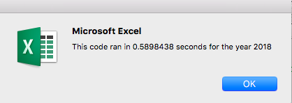
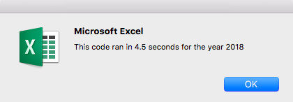

# stock-analysis

## Overview of Project:
### Purpose
The goal of this project was to help Steve come up with a financial stock plan to help his first clients (his parents) invest in green stocks that will make them money. Going through the two years of data with 12 different green stocks, we wanted to create an easier way to analyze the data. Using VBA, we were able to simplify the data and show the statistics that were important for Steve. Through refactoring, we were able to gather data in a timely matter.

## Results
### Stock Perfomance
-In 2017, the 12 stocks we were doing data on did quite well. 

-As you can see, 10 of the 12 stocks had a profitable year. This is a great sign if you are interested in this field of stocks.

-Unfortunately, the momentum of these stocks from 2017 went the opposite way in 2018.

-In this year, 10 of the 12 stocks had negative returns. As great as 2017 was in this field, 2018 had the opposite outcome.

-The only two stocks to have profitable returns in both years were ENPH and RUN.

### Execution Times
- When we refactored our data, the code ran significantly faster for both years. As you can see in the pictures below, the refactored code ran in under a second, and the non refactored code ran in about 4.5 seconds.

- 2017 Refactored 
- 2017 not refactored 

- 2018 Refactored 
- 2018 not Refactored 

   

## Summary

1. The advantages of refactoring data are, once coded, the code runs quicker and it is easier to update data that is not added into a data set yet. Once the refactored code is set up, it makes automating the data much easier. The disadvantage of refactoring data is the time it takes to code. Sometimes, a dataset does not need to be automated and hard coding makes more sense.

2. As far as this project goes, I do think refactoring the code did make sense. It sped up the process almost 8 times quicker once it was refactored. It also cleaned up the code and made the excel page more efficient. Overall, it was the right move to refactor here.
